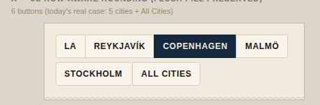
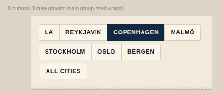
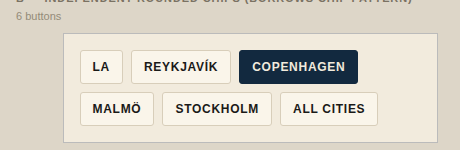
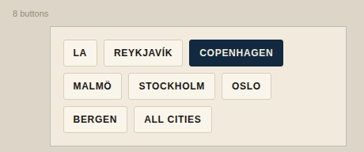
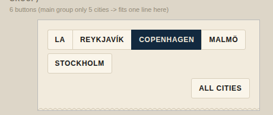
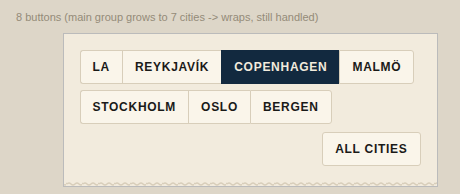
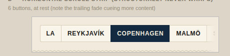
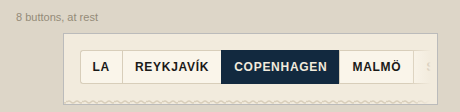
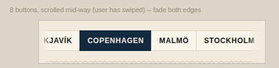

# City filter wrap — concept stage

Problem: `#cityFilters` is a flush segmented control (`.city-btn`, no gap,
shared borders) that only rounds `:first-child`/`:last-child`. It assumes
one line. On a real phone, 5 cities + "All cities" already wraps to two
lines, and whatever lands first on line 2 keeps square corners on both
sides — it reads as a broken fragment, not a button. Because `cities` is
runtime-extensible (`addCity()`), the *main* group will eventually wrap too,
for the same reason.

Per the owner: the "cities must look structurally different from category
chips" rule is history explaining today's shape, not a constraint on this
work. The bar is (1) it looks intentional at any wrap point, for any city
count, and (2) it still reads clearly as single-select. Chip-like solutions
are fair game if they clear both bars.

All mockups reuse the real tokens (`--paper`, `--paper-raised`, `--navy`,
`--ink`, `--hair`, `--s2`/`--s3`/`--s4`, `--font-ui`) and the real
`.city-btn` type treatment (12px uppercase, 600 weight, 0.06em tracking) —
see `proto.html`. Google Fonts couldn't be reached from this sandbox, so
screenshots fall back to system sans; the shape/spacing math is unaffected.
Two scenarios per approach: **6 buttons** (today's actual case — 5 cities +
All cities) and **8 buttons** (a hypothetical 7th/8th city, to prove the
approach doesn't just paper over today's specific count).

---

## A — JS row-aware corner rounding

Keep the flush touching-border pill exactly as it looks today. A small
script (`markRowEdges()` in `proto.html`) measures `offsetTop` after render
and tags whichever button is first/last *on its own rendered line* with
`.row-start`/`.row-end`, which is what actually gets the rounded corners —
not `:first-child`/`:last-child`. Re-run on resize and whenever the city
list changes (`createCitySelector()` already re-renders on both).

**Verdict:** Looks completely intentional — every wrapped row reads as its
own clean pill, "All Cities" landing alone on its own line (8-button case)
reads as a deliberate standalone button, not a fluke. Single-select reads
exactly as well as it does today, because the visual language is literally
unchanged — same touching borders, same solid-navy active fill.
**Cost:** the only approach here that needs real JS logic that has to
re-run on resize *and* on every city-list mutation (`fetchCities()` merging
in a new row) — a measurement dependency the other three approaches don't
have. Layout-thrash risk is low (one `offsetTop` read per button, no
repeated reflow loop), but it's still a moving part that can silently go
stale if a future refactor changes how/when `createCitySelector()` runs.
No a11y/tap-target concern — button boxes are unchanged.

---

## B — Independent rounded chips, gapped (borrows the chip pattern)

Give every `.city-btn` its own `border-radius: 3px` and a `--s2` (8px) gap,
i.e. literally `.filter-btn`'s spacing applied to the city buttons. No
measurement, no JS. Single-select is communicated the same way it already
is: solid `--navy` fill + `--paper` text for `.active`, vs. `--paper-raised`
+ `--hair` border for everyone else — that treatment doesn't change here at
all, it's exactly what already runs on the flush version today.

**Verdict:** Looks finished at any wrap point, trivially — there's no
"first item on a wrapped line" concept left to break, because nothing is
touching. It reads fine as single-select for the same reason it reads fine
today: one filled navy chip among unfilled ones is an unambiguous "this one
is chosen" signal regardless of whether the chips touch. The genuine risk
the brief asks to evaluate honestly: at a glance, does it read as
*obviously* different from the category badge grid below it? Somewhat
less than the flush version, yes — but the two groups aren't adjacent
(the rope-braid divider still separates them), the category chips carry
glyphs and dashed-vs-solid-rule states that city chips don't, and the
active treatment (solid fill vs. a bottom rule) is already a different
grammar between the two groups. It reads as "a different flavor of the
same chip idea," not as "identical, so is this multi-select too?" —
which is what the original 2-look rule was actually protecting against.
**Cost:** essentially free — delete four fragile `:nth-last-child`/
`:first-child`/`:last-child` rules, add one `gap`. Nothing to re-run on
resize or city-list change; scales to any number of cities with zero new
code. Slightly larger combined footprint (gaps add width) but at 6-8
buttons this cost the same wraps it does today, just cleaner.

---

## C — "All Cities" always on its own row, decoupled from the wrap problem

Force "All cities" onto a permanent row below the main group (right-aligned,
own pill), regardless of whether the main group wraps. Combined here with
Approach A's row-aware rounding for the main group itself, since that group
can still grow into a second line as `addCity()` adds more cities.

**Verdict:** Solves the *specific, currently-reported* bug (today it's
"All Cities" that lands as the broken fragment) very cleanly, and gives
"All cities" a bit of extra semantic weight as "the odd one out" (it
already gets a small gap treatment in the current code, so this is a
continuation of that idea, not a new one). But it only decouples *one*
button from the wrap problem — the main group still needs either
approach (A)'s JS or (B)'s gapped chips once it grows past one line, so
this is strictly an additive complexity on top of A or B, not a
replacement for either. It doesn't look "wrong" at either button count,
but it does add a second row unconditionally even when everything already
fits on one line at a wider viewport — a layout cost paid every time.
**Cost:** whichever of A/B it's paired with, plus one more structural
concept (two groups instead of one) that has to stay in sync in
`createCitySelector()`.

---

## D — Horizontal scroll strip, structurally never wraps

Genuinely different idea, not a wrap-corner fix: give up on wrapping
entirely. `#cityFilters` becomes `flex-wrap: nowrap; overflow-x: auto`,
each button keeps its own rounded corners (like a compact version of B),
and a `--paper` fade gradient on the trailing edge (both edges once
scrolled) signals there's more off-screen — the same convention as Apple
Maps' category strip / App Store chart-genre tabs.

**Verdict:** Sidesteps the entire class of bug rather than managing it —
there is no wrap point, ever, at any city count, so there's nothing to get
"right" per-line. It's also a very legible, extremely common single-select
convention on its own (a horizontally-scrolling tab strip reads as "pick
one" even more unambiguously than a wrapping grid does, precisely because
wrapping grids are what multi-select badge fields look like). Genuine
concept-level UX concern, flagged honestly: discoverability. A user has to
notice the fade and swipe to find a city that isn't in the first ~4; if the
owner's own city (or a newly-`addCity()`'d one) always ends up off-screen,
that's a real regression versus "everything is visible at once," which the
current design (and A/B/C) all preserve. Partial-button-peeking at the
trailing edge (visible in the 6- and 8-button "at rest" shots) mitigates
this somewhat by hinting more exists, but it's not as strong a signal as
literally seeing all of Stockholm/Malmö/Oslo/Bergen laid out on a second
line. Tap targets are unaffected; the scroll gesture can conflict with a
user trying to scroll the page vertically right where the strip sits,
though that's a minor, well-understood tradeoff (native horizontal scroll
areas handle this fine in practice).
**Cost:** no JS, no measurement, nothing to re-run on resize or city-list
growth — CSS-only and the most future-proof of the four in that sense. But
it trades that robustness for hiding some of the list by default, which is
the one thing every other approach avoids.

---

## Recommendation: **B**, independent rounded chips with a gap

It's the only approach that is simultaneously (1) trivial to implement —
a net deletion of the fragile corner-rounding rules, not an addition, (2)
correct at *any* city count with zero moving parts to keep in sync (no
resize listener, no re-run hook tied to `createCitySelector()`), and (3)
unambiguous as single-select, because the thing that actually communicates
single-select — the solid-navy `.active` fill versus everyone else's
`--paper-raised` — is untouched from today's implementation and was never
the touching-borders. The touching borders were solving a problem (visual
distinction from categories) that a *different* signal (the fill/rule
grammar) already solves on its own, made obvious once you see B next to the
badge grid: it doesn't read as "maybe multi-select," it reads as "a chip
row where one is picked."

A (row-aware JS rounding) is the right call **only** if the owner wants to
keep today's exact flush-pill look pixel-for-pixel and is fine owning the
maintenance cost of a measurement pass that has to be correct forever,
including every time a city gets added at runtime. That's a real, ongoing
cost for a purely aesthetic preference (the pill silhouette) once B already
clears both bars the owner actually cares about. D is worth keeping in
back pocket specifically for the "list ordering is confusing" /
trip-vs-place open items — if the city count grows meaningfully (multi-trip
support, etc.) a scroll strip becomes the *more* correct answer, but for
today's 5-6 cities it's solving a problem the app doesn't have yet at the
cost of hiding some cities by default. C isn't worth its added structural
complexity on its own; if "All cities" deserves a distinct treatment for
semantic reasons, that's a small optional garnish on top of B, not a
separate approach.

**Concept-level UX check (per the process, not polish):** none of A/B/C/D
break tap-to-navigate, scroll, delete safety, or a11y basics — no delete
affordance lives in this control, no scroll-gesture ownership conflict
except D's (flagged above), and button `role`/focus semantics are
unaffected by any of the four (still plain `<button>` elements, same click
handler wiring through `setActiveCity()`).
